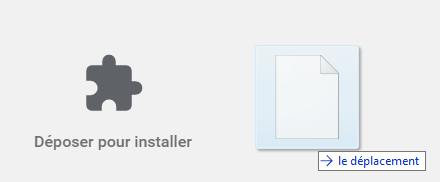
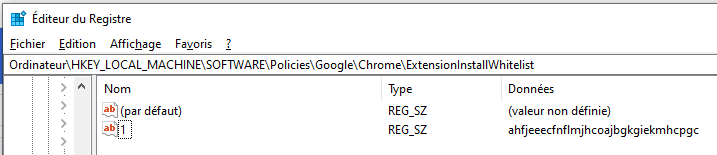

# Deezidix
Simple chrome extension to download songs, album or playlists in Deezer.  
Base on the work of @An0nimia ([Deezloader](https://github.com/An0nimia/deezloader))

# Disclaimer
- I am not responsible for the usage of this program by other people.
- I do not recommend you doing this illegally or against Deezer's terms of service.
- This project is licensed under [CC BY-NC-SA 4.0](https://creativecommons.org/licenses/by-nc-sa/4.0/)

# Installation
## Mozilla
You simply have to drag and drop [deezidix-1.0-an+fx.xpi](./deezidix-1.0-an+fx.xpi) in mozilla.  

## Chrome
### Step 1: Developer mode
Activate developer mode in chrome extension page.
### Step 2: Install extension
Drag and drop [Deezidix.crx](./Deezidix.crx) in chrome extension page.  

### Step 3: Activate extension
Now Extension is installed but can't enabled.  
To force chrome to activate it, we need to add a registry key.  
1. First, not the extension identifier.  

2. Go in regedit and create this following key
*HKEY_LOCAL_MACHINE\SOFTWARE\Policies\Google\Chrome\ExtensionInstallWhitelist*  
After that add a string value with name '1' and value the extension identifier (as below).  

3. Now you can restart chrome and see that the extension is activated !  

# Usage
## Download playlist or album
Go in deezer on album or playlist page and click in "Download this album/playlist" (*playlist need to be public not private*)  
  
Wait a few seconds and the files will be downloaded.

## Download specific songs
For each song you want to download check his checkbox and click on "Download selected tracks".  
  
Wait a few seconds and the files will be downloaded.
